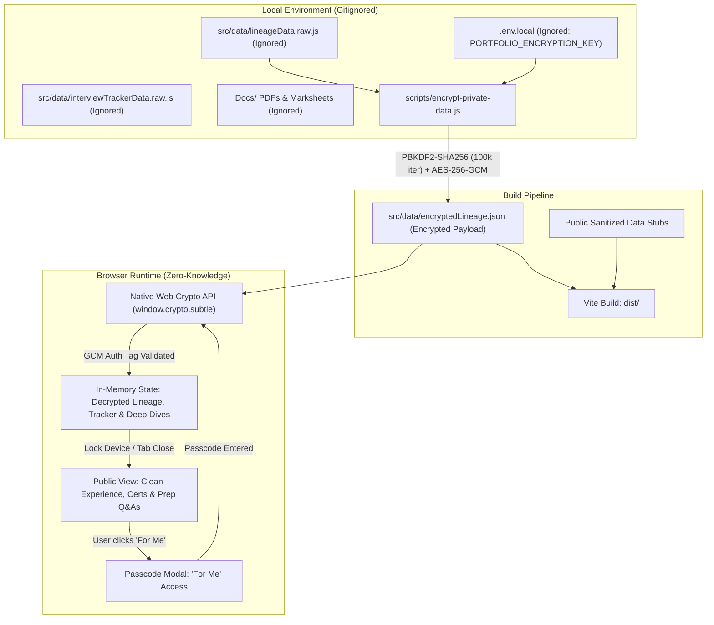

# 🌐 Shubham Srivastava — Portfolio & Technical Knowledge Base

[](https://github.com/Chresko08/my-portfolio/actions/workflows/deploy.yml)
[](https://reactjs.org/)
[](https://vitejs.dev/)
[](https://www.framer.com/motion/)
[](https://github.com/Chresko08/my-portfolio)
[](https://chresko08.github.io/my-portfolio/)

A modern, fast, and interactive developer portfolio and high-yield technical knowledge base for **Shubham Srivastava**, Senior Data Engineer & Distributed Systems Practitioner. Built with **React 18**, **Vite**, and **Framer Motion**, featuring glassmorphic UI design, an interactive 17-track Big Data & Cloud interview preparation engine, a zero-knowledge AES-256 encrypted career lineage module, dark/light theme switching, and automated CI/CD deployment via GitHub Actions.

🔗 **Live Deployment:** [https://chresko08.github.io/my-portfolio/](https://chresko08.github.io/my-portfolio/)

---

## 📑 Table of Contents

- [Key Highlights](#-key-highlights)
- [Zero-Knowledge Data Privacy Architecture](#-zero-knowledge-data-privacy-architecture)
- [17-Topic Interview Preparation Engine](#-17-topic-interview-preparation-engine)
- [Tech Stack](#-tech-stack)
- [Project Architecture & Structure](#-project-architecture--structure)
- [Component Breakdown](#-component-breakdown)
- [Getting Started](#-getting-started)
  - [Prerequisites](#prerequisites)
  - [Installation](#installation)
  - [Local Encryption Configuration](#local-encryption-configuration)
  - [Development Server](#development-server)
  - [Production Build & Leak Audit](#production-build--leak-audit)
- [Available Scripts](#-available-scripts)
- [Deployment](#-deployment)
  - [Automated Deployment (GitHub Actions)](#automated-deployment-github-actions)
  - [Manual Deployment](#manual-deployment)
- [Connect & Contact](#-connect--contact)
- [License](#-license)

---

## 🌟 Key Highlights

- **⚡ Blazing Fast Bundling:** Built with Vite 4 with sub-second Hot Module Replacement (HMR).
- **🎨 Glassmorphic Design System:** Frosted glass cards (`backdrop-filter: blur(14px)`), ambient radial gradient orbs, and typography powered by Google Font *Outfit*.
- **🔒 Zero-Knowledge Client-Side AES-256 Encryption:** Protects personal career documents, compensation baselines, and private interview audits while keeping the repository 100% public on GitHub Pages free tier.
- **📚 17-Topic Interview Readiness Engine:** Comprehensive question-and-answer platform covering modern lakehouse architectures, distributed systems, streaming engines, and SQL optimizations with multi-topic cross-tagging, search by text or question number, complexity filtering, and local bookmarking.
- **💼 Chronological Career & Education Lineage (2004 – 2026):** Complete professional progression timeline encompassing education (ICSE, ISC, AKTU B.Tech), corporate training (Infosys), enterprise tenures (Infosys, TCS, EY), and architectural deep dives.
- **🌓 Instant Theme Switching:** Dark and Light mode toggle with smooth animated transitions and `localStorage` persistence.
- **📜 Verified Credentials Grid:** Dedicated cards for AWS Certified Cloud Practitioner and verified HackerRank domain credentials.
- **🤖 Automated CI/CD:** Auto-deploys to GitHub Pages on every push to `main` with build-date injection.

---

## 🔒 Zero-Knowledge Data Privacy Architecture

Because GitHub Pages requires a public repository on the free tier, sensitive personal career records (exact compensation packages, resignation dates, active pipeline trackers, client gate post-mortems, institutional roll numbers, and employee IDs) cannot be stored in plaintext within git.

This project implements a **Zero-Knowledge Client-Side AES-256-GCM Encryption Architecture**:



### Security Properties
1. **Airgapped Source of Truth:** `Docs/`, `*.raw.js`, and `.env.local` are strictly `.gitignore`d.
2. **Deterministic Cryptography:** Key derived via PBKDF2 with SHA-256 over 100,000 iterations using a 16-byte random salt, encrypted with AES-256-GCM using a 12-byte random IV and 16-byte authentication tag.
3. **Zero Leaks in Production Bundles:** All personal numbers, employee IDs, and company transition names are rendered dynamically from the decrypted payload in browser memory. Verified via an automated audit of `dist/assets/*.js`.
4. **Native Browser Decryption:** Decryption uses `window.crypto.subtle` with 0 npm dependencies, rejecting invalid passcodes immediately upon GCM tag mismatch.

---

## 📚 17-Topic Interview Preparation Engine

The **Interview Preparation** section has been architected as an interactive engineering study platform:

| # | Topic | Key Focus Areas |
|:---:|:---|:---|
| 1 | **Advanced SQL** | Window functions, CTEs, recursive queries, query optimization, join strategies, indexing |
| 2 | **Hadoop / Hive** | HDFS block topology, NameNode/DataNode, MapReduce lifecycle, Hive on Tez, ORC/Parquet |
| 3 | **PySpark** | Catalyst optimizer, DAG execution, Adaptive Query Execution (AQE), skew joins, memory tuning |
| 4 | **Python** | OOP for ETL pipelines, generators, memory optimization, data engineering coding algorithms |
| 5 | **Azure** | ADLS Gen2, Azure Data Factory (ADF), Synapse Dedicated SQL Pools, integration runtimes |
| 6 | **Databricks** | Delta Lake ACID logs (`_delta_log`), Unity Catalog, Photon, Liquid Clustering, Z-Ordering |
| 7 | **Distributed Systems & System Design** | CAP theorem, distributed consensus, partitioning, backpressure, idempotency |
| 8 | **Data Modeling** | Star & Snowflake schemas, Fact vs Dimension, Grain, SCD Types 1/2/3, Data Vault |
| 9 | **Dataproc** | Ephemeral cluster lifecycle, autoscaling, preemptible/spot nodes, Composer orchestration |
| 10 | **Dataflow** | Apache Beam, unified batch/streaming, PCollections, PTransforms, watermarks, triggers |
| 11 | **Cloud Composer** | Apache Airflow, DAG architecture, custom operators, sensors, XComs, idempotent backfills |
| 12 | **BigQuery** | Capacitor columnar storage, partitioning, clustering, slot reservations, MERGE DML |
| 13 | **dbt (Data Build Tool)** | Incremental models, snapshots for SCD, tests, sources, Jinja macros, lineage graphs |
| 14 | **Unix & Shell** | Bash/Zsh scripting, `awk`, `sed`, `grep`, cron routines, process management, file streaming |
| 15 | **CI/CD & DevOps** | Git workflows, automated testing, containerization, environment promotion sequences |
| 16 | **Data Governance** | Data quality frameworks (Deequ, Great Expectations), PII masking, policy tags, audit trails |
| 17 | **Google Pub/Sub & Kafka** | Message brokers, partitions, consumer groups, offset management, Change Data Capture (CDC) |

### Key Engine Features
- **Cross-Topic Tagging:** Questions mapped across multiple domains dynamically render under all applicable topic filters.
- **Search by Number or Text:** Instant search filter supporting question numbers (e.g., `#2`, `Q4`) as well as keywords in questions, answers, and tags.
- **Complexity Filtering:** Quick toggles for *All*, *Basic*, *Intermediate*, and *Complex* questions.
- **Study State Persistence:** Question completion and bookmarks persist across sessions via `localStorage`.

---

## 🛠 Tech Stack

### Core Framework & Tooling
| Technology | Role |
| :--- | :--- |
| **[React 18](https://react.dev/)** | Component-based UI library |
| **[Vite 4](https://vitejs.dev/)** | Frontend bundler and development server |
| **[Framer Motion](https://www.framer.com/motion/)** | Fluid micro-interactions and layout animations |
| **[Web Crypto API](https://developer.mozilla.org/en-US/docs/Web/API/Web_Crypto_API)** | Client-side native AES-256-GCM cryptographic decryption |
| **[React Icons](https://react-icons.github.io/react-icons/)** | Feather Icons and Simple Icons |
| **[gh-pages](https://www.npmjs.com/package/gh-pages)** | Static deployment utility for GitHub Pages |

### Styling & Design System
- Pure CSS3 with semantic variables (`--bg-color`, `--surface-color`, `--primary-color`, etc.)
- Frosted glassmorphism design tokens with responsive layout grids
- Google Font: **[Outfit](https://fonts.google.com/specimen/Outfit)** (300 through 800 weights)

---

## 📂 Project Architecture & Structure

```
my-portfolio/
├── .github/
│   └── workflows/
│       └── deploy.yml              # Automated GitHub Pages CI/CD workflow
├── Docs/                           # Private records & PDFs (Gitignored)
├── public/
│   └── profile.jpg                 # Profile photograph
├── scripts/
│   ├── encrypt-private-data.js     # AES-256-GCM encryption pipeline
│   └── decrypt-private-data.js     # CLI decryption & verification utility
├── src/
│   ├── components/
│   │   ├── BackToTop.jsx           # Floating scroll-to-top button
│   │   ├── CareerLineage.jsx       # 2004–2026 Lineage & Project Deep Dives
│   │   ├── Certificates.jsx        # AWS CCP highlight & HackerRank badges
│   │   ├── Contact.jsx             # Contact CTA, email clipboard button & socials
│   │   ├── Experience.jsx          # Public experience timeline
│   │   ├── Hero.jsx                # Availability badge, introduction & quick CTAs
│   │   ├── InterviewPrep.jsx       # 17-Topic cross-cutting prep engine
│   │   ├── InterviewTracker.jsx    # Interview evaluation records component
│   │   ├── Logo.jsx                # Isometric streaming data cube SVG logo
│   │   ├── Navbar.jsx              # Navigation bar with theme toggle & 'For Me' unlock
│   │   └── PasswordModal.jsx       # Zero-knowledge passcode entry modal
│   ├── data/
│   │   ├── encryptedLineage.json   # AES-256-GCM encrypted payload (Committed)
│   │   ├── interviewTrackerData.js # Public tracker stub (Committed)
│   │   ├── lineageData.js          # Public lineage stub (Committed)
│   │   ├── interviewTrackerData.raw.js # Private raw data (Gitignored)
│   │   ├── lineageData.raw.js      # Private raw lineage data (Gitignored)
│   │   └── interview/              # 17-topic question banks
│   ├── utils/
│   │   └── crypto.js               # Browser Web Crypto API decryption engine
│   ├── App.jsx                     # Application root & view mode orchestrator
│   ├── index.css                   # Theme tokens & glassmorphic styling
│   └── main.jsx                    # React 18 DOM mount entry point
├── .env.local                      # Local encryption secret (Gitignored)
├── .gitignore                      # Airgapped ignore rules
├── index.html                      # HTML5 entry template
├── package.json                    # Scripts and dependencies
└── vite.config.js                  # Vite configuration
```

---

## 🚀 Getting Started

### Prerequisites
- **[Node.js](https://nodejs.org/)** (v18.0.0 or higher recommended)
- **[npm](https://www.npmjs.com/)** (v9.0.0 or higher)

### Installation
1. Clone the repository:
   ```bash
   git clone https://github.com/Chresko08/my-portfolio.git
   cd my-portfolio
   ```
2. Install dependencies:
   ```bash
   npm install
   ```

### Local Encryption Configuration
For local development with private data:
1. Create a `.env.local` file in the project root (automatically gitignored):
   ```bash
   PORTFOLIO_ENCRYPTION_KEY="your-secret-passcode"
   ```
2. Place private raw data in `src/data/lineageData.raw.js` and `src/data/interviewTrackerData.raw.js`.
3. Encrypt the dataset:
   ```bash
   npm run encrypt-data
   ```

### Development Server
Start the Vite local development server:
```bash
npm run dev
```
Open `http://localhost:5173/my-portfolio/` in your browser.

### Production Build & Leak Audit
To compile and bundle optimized static assets:
```bash
npm run build
```
The `prebuild` hook will automatically encrypt the dataset before bundling. The compiled output will be placed in `dist/`.

---

## 📜 Available Scripts

| Command | Description |
| :--- | :--- |
| `npm run dev` | Starts the Vite development server with HMR |
| `npm run build` | Encrypts raw data and builds the production bundle in `dist/` |
| `npm run encrypt-data` | Encrypts `lineageData.raw.js` into `encryptedLineage.json` using AES-256-GCM |
| `npm run preview` | Locally serves the production build for verification |
| `npm run lint` | Runs ESLint to check for code style and syntax issues |
| `npm run deploy` | Deploys the built `dist/` directory to GitHub Pages via `gh-pages` |

---

## 🚢 Deployment

### Automated Deployment (GitHub Actions)
The repository includes automated CI/CD at [`.github/workflows/deploy.yml`](.github/workflows/deploy.yml).
- Pushes to the `main` branch trigger automated building and testing.
- The workflow compiles the app with the pre-built `encryptedLineage.json` artifact.
- Deploys the `dist/` directory to the `gh-pages` branch.

### Manual Deployment
To deploy directly from your local terminal:
```bash
npm run deploy
```

---

## 📬 Connect & Contact

- **Name:** Shubham Srivastava
- **Role:** Senior Data Engineer & Cloud Analytics Consultant
- **Email:** [shubhamsrivastava08@gmail.com](mailto:shubhamsrivastava08@gmail.com)
- **LinkedIn:** [linkedin.com/in/chresko](https://www.linkedin.com/in/chresko)
- **GitHub:** [@Chresko08](https://github.com/Chresko08)
- **LeetCode:** [leetcode.com/u/shubham_chresko](https://leetcode.com/u/shubham_chresko/)
- **Resume:** [View on Google Drive](https://drive.google.com/file/d/13T3uAmP2iG6Pq2qosDZdNuk17G41v7cf/view?usp=share_link)

---

## 📄 License

This project is open source and available under the [MIT License](LICENSE).
